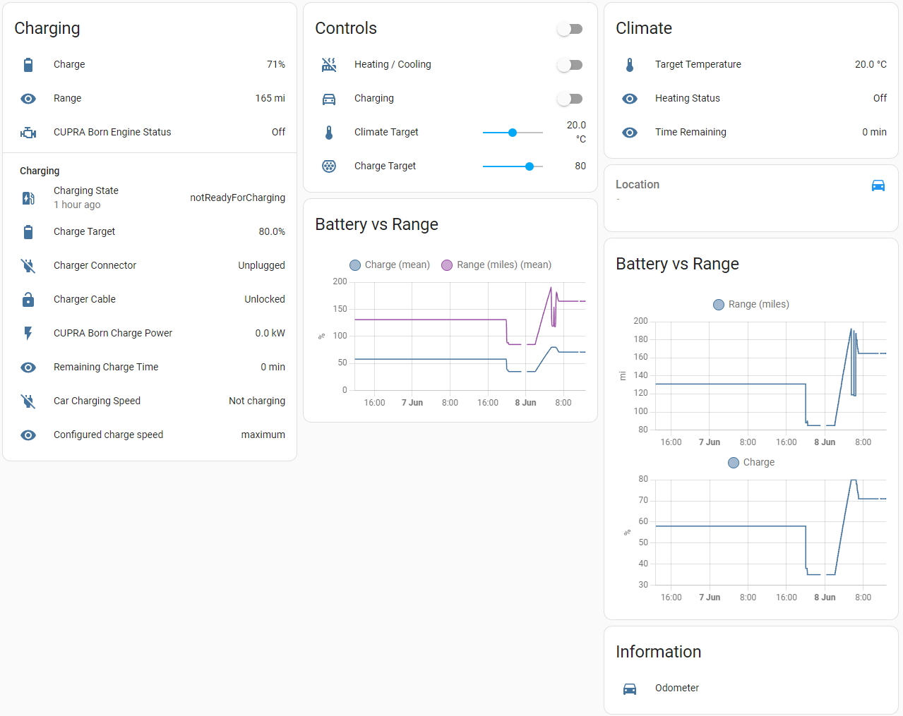
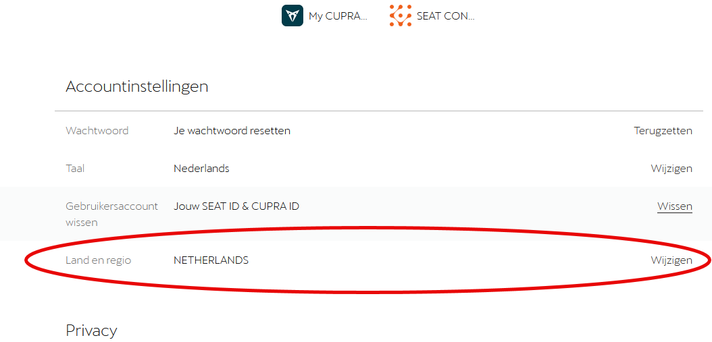

# Cupra Formentor Home Assistant Integration

_This integration is a fork of [daernsinstantfortress/cupra_we_connect](https://github.com/daernsinstantfortress/cupra_we_connect), specifically adapted to support only the **Cupra Formentor**._ 

## Supported Platforms
Platform | Description
-- | --
`sensor` | Retrieves and displays vehicle information.
`binary_sensor` | Monitors vehicle status, such as door locks and battery levels.
`button` | Allows for remote actions like starting/stopping charging or climatization.
`number` | Configures values such as target SOC and climate temperature.
`device_tracker` | Tracks the location of your vehicle.

## Installation

### HACS Installation
1. Open [HACS](https://hacs.xyz/) in Home Assistant.
2. Search for "Cupra Formentor" and install the integration.
3. Follow the [Configuration](#configuration) steps below.

If the integration does not appear in HACS, manually add `https://github.com/cfpandrade/cupra_formentor` as a custom repository.

### Manual Installation
1. Navigate to your Home Assistant configuration directory.
2. Create a `custom_components/cupra_formentor` folder if it does not exist.
3. Download and place all repository files in this folder.
4. Restart Home Assistant and follow the [Configuration](#configuration) steps.

### Configuration
1. Ensure that the Cupra We Connect app is set up and used at least once.
2. Navigate to **Settings → Integrations** in Home Assistant.
3. Add the "Cupra Formentor" integration and enter your login credentials.
4. Wait for the vehicle to appear with its entities.

### Authentication Issues
If authentication fails, ensure you have accepted all Cupra WeConnect terms:
1. Log in at [Cupra We Connect](https://cupraid.vwgroup.io/account).
2. Accept any pending terms.
3. Temporarily change your country/region, save, log out, and log back in.
4. Revert country/region changes and reload the Cupra integration.

## Supported Vehicles
* Cupra Formentor 2021+

## Requirements
* Home Assistant Core *2022.7.0* or later

## Acknowledgments
Special thanks to @mitch-dc for the VW ID integration foundation, @tillsteinbach for the WeConnect Python library, and Alan Gibson for adapting it to Cupra. This version has been specifically tailored for **Cupra Formentor** by @cfpandrade.
